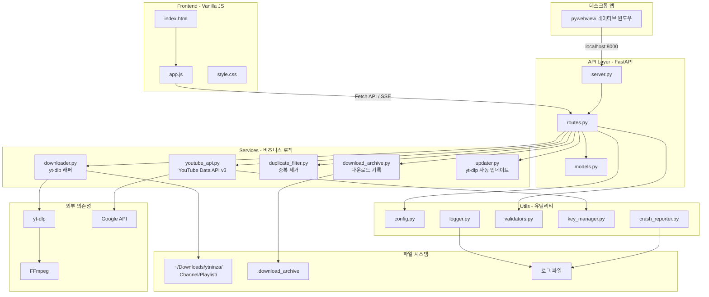
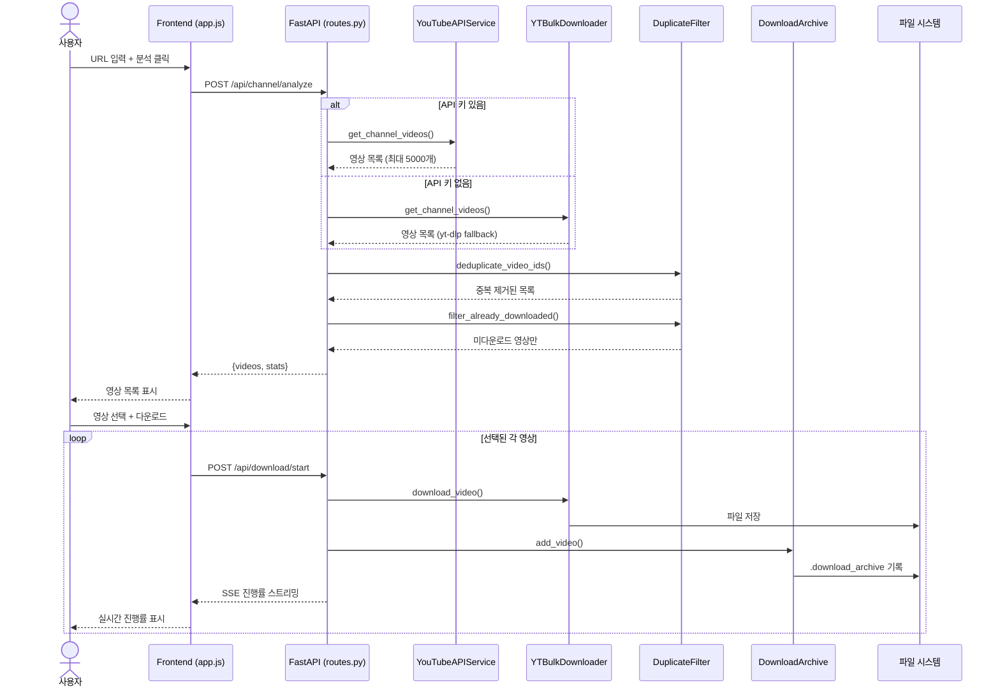
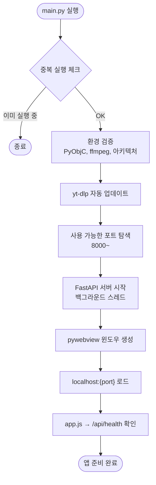

# ytninza Architecture

## 전체 시스템 구조



## 사용자 요청 흐름



## 앱 시작 흐름



## 디렉토리 구조

```
ytninza/
├── src/
│   ├── main.py                  # 앱 진입점 (pywebview + FastAPI)
│   ├── api/
│   │   ├── server.py            # FastAPI 앱 설정, ASGI
│   │   ├── routes.py            # HTTP 엔드포인트 (30+개)
│   │   └── models.py            # Pydantic 요청/응답 모델
│   ├── services/
│   │   ├── downloader.py        # yt-dlp 래퍼 (YTBulkDownloader)
│   │   ├── youtube_api.py       # YouTube Data API v3 (YouTubeAPIService)
│   │   ├── duplicate_filter.py  # 중복 제거 (Set + SHA-256 + 제목 매칭)
│   │   ├── download_archive.py  # 다운로드 기록 관리
│   │   └── updater.py           # yt-dlp 자동 업데이트
│   ├── utils/
│   │   ├── config.py            # 설정, 경로, 버전
│   │   ├── logger.py            # 로깅 (파일 + 콘솔, 7일 로테이션)
│   │   ├── validators.py        # URL 검증, ID 추출
│   │   ├── key_manager.py       # API 키 관리
│   │   ├── crash_reporter.py    # 크래시 리포트
│   │   └── webview2_setup.py    # Windows WebView2 체크
│   └── frontend/
│       ├── index.html           # SPA 구조
│       ├── css/style.css        # 스타일링
│       └── js/app.js            # 프론트엔드 로직
├── resource/                    # 정적 에셋 (사운드, 이미지)
├── .github/workflows/           # GitHub Actions CI/CD
└── ytninza.spec               # PyInstaller 빌드 설정
```

## 핵심 설계 결정

| 결정 | 이유 |
|------|------|
| **Dual-Path** (YouTube API + yt-dlp fallback) | API 키 없이도 동작, 있으면 빠름 |
| **pywebview + FastAPI** | 크로스플랫폼 데스크톱 앱을 웹 기술로 구현 |
| **SSE (Server-Sent Events)** | 폴링 없이 실시간 다운로드 진행률 |
| **3단계 중복 제거** | Set(ID) → archive 파일 → 제목 매칭 |
| **yt-dlp 자동 업데이트** | YouTube 변경에 자동 대응 |
| **채널/플레이리스트/영상 폴더 구조** | 정리된 다운로드 관리 |
